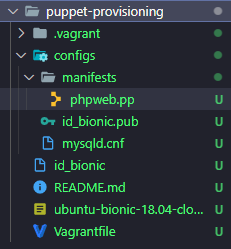
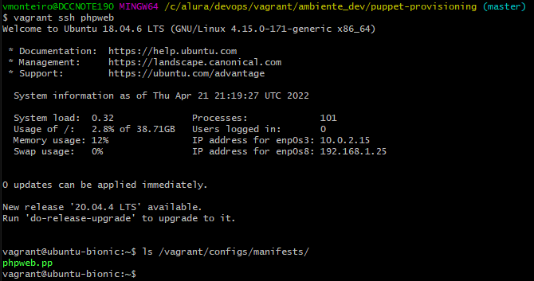
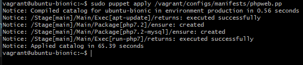

## Provisionando pelo [Puppet](https://www.vagrantup.com/docs/provisioning/puppet_apply)

Antes vinha fazendo o provisionamento direto pelo Shell (Shell Provisioning), agora vou [provisionar usando a ferramenta Puppet](https://www.digitalocean.com/community/tutorials/getting-started-with-puppet-code-manifests-and-modules)  
Criado a partir da máquina virtual ***bionic-multi-machine***  
Serve para simplificar o provisionamento, provisionar usando uma ferramenta é mais simples e fácil do que direto pelo Shell

### Provisionando

- Provisionar = conceder provisão ('documento') a (alguém) para o exercício de algumas profissões; guarnecer-se de provisões (abastecimento ou fornecimento); abastecer-se ou aprovisionar. Significa meio que criar a infraestrutura, fornecer o que é necessário para realizar uma tarefa.

### Primeira difereça -> pasta `manifests` dentro de `configs`

> Puppet programs are called manifests. Manifests are composed of puppet code and their filenames use the .pp extension. The default main manifest in Puppet installed via apt is /etc/puppet/manifests/site.pp

Esse arquivo `.pp` pode ser acessado na máquina virtual pelo comando `vagrant ssh phpweb` na máquina *host* (a máquina virtual tem que estar rodando para conseguir acessar o arquivo)

Agora podemos instalar o Puppet de fato, usando o `vagrant ssh phpweb` pela linha de comando do *host*

Essa é uma desvantagem de usar uma ferramenta secundária para provisionamento, todas as máquinas precisam ter o Puppet instalado e rodando (aqui fazendo manual, mas depois fazemos integrando o Vagrant com o Puppet)

Com o Puppet instalado podemos rodar o arquivo `phpweb.pp`

A leitura da execução é bem mais amigável, mostra bem o status final da execução e o comando que foi executado  
E agora tem uma versão do *php* rodando na máquina virtual

Para configurar a instalação do Puppet pelo Vagrant, voltamos para o arquivo Vagranfile, na linha 55, dentro do bloco do `config.vm.define "phpweb" do |phpweb|`  
Agora temos que rodar o arquivo `phpweb.pp`, daí vem a integração do Vagrant com o Puppet, e o subbloco que começa na linha 57 do Vagrantfile